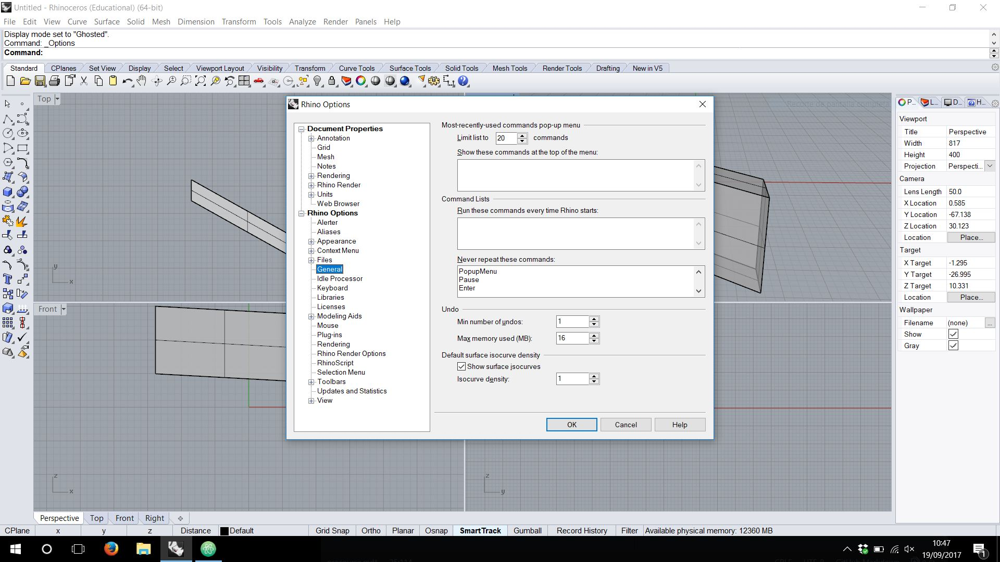
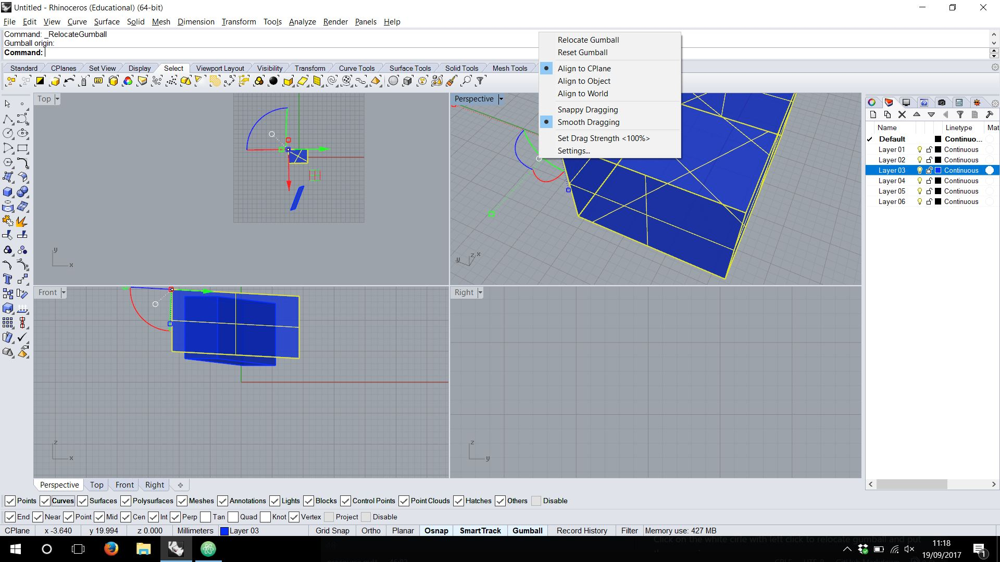
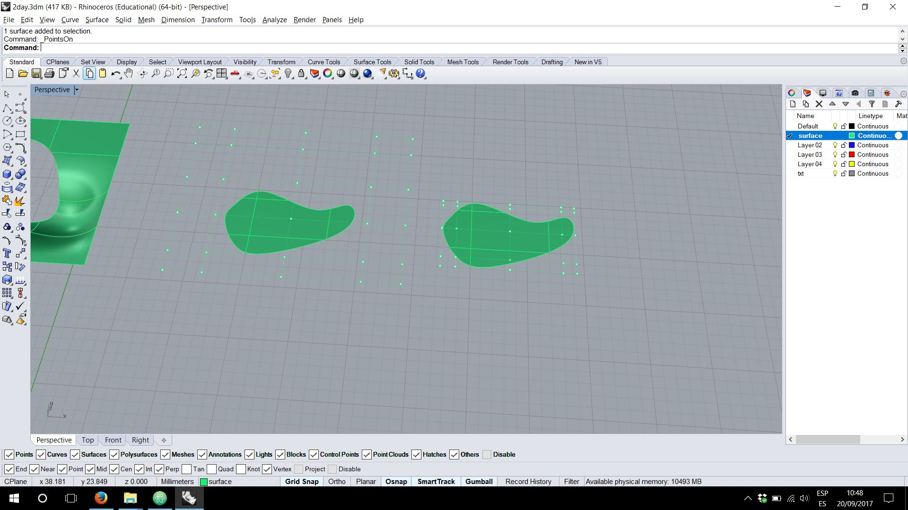
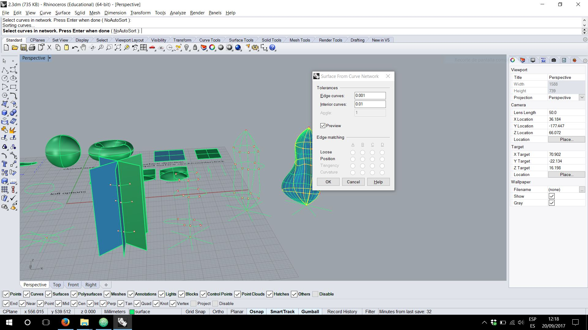
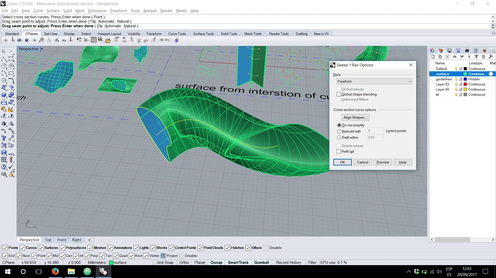
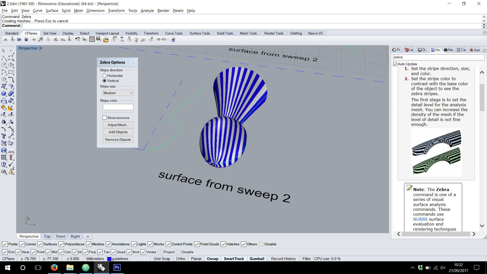
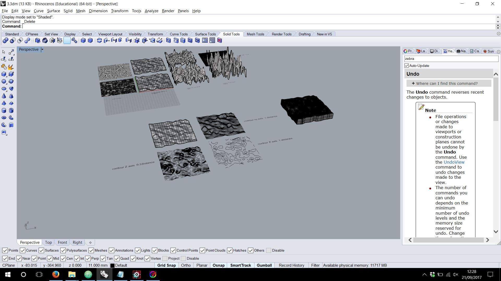

# Precourse - Rhino

[Class Google Drive Examples](https://drive.google.com/drive/u/2/folders/0B9mK0dOv8IABT05zUlF6cWg5OWc)

**Nurbs**
Geometrical spline that defines surfaces
Advantages
- when you want to edit it is really easy to change shapes

### Commands [Rhino Working file 1](rhino/1.3dm)

- Right for rotating
- Left for selecting
- Shift+ Right pan
- Cntrl+ Right zoom
- Alt + Right   Zoom
- Shift+alt+right  Tilt

If you make want a make a line in vertical

 - Command line / press control while click again in the initial point/ now your line is in the Z axis

**3d curve** by pressing control and clik for control point

+ **CONTROL+SHIFT+LEF  Select FACE**

+ **Change the line of dots/dash lines**
 _ setlinetypescale

 and change the values until you see it nicely

``SEAPLANE = working table``

Double click on the viewport type(perspective,top,etc)To full screen it.*double click again to return to 4 views*

Tools/options **all configuration of Rhino**

Lens recommendation ( right panel)
- 50mm
- 35mm

#### Filter

To allow you select only what it is active

#### Gumball

Scale/Rotate/Move
*Double click on it to allow you to introduce units*

+ +Shift it will do it proportional

Click on the white cirle with left click to relocate gumball and put the new axis.

**Press Cntrl after moving to  create a surface from curves**

``if you want to toggle the control points of a curve you can use CONTROL POINTS by activating F10-F11``

#### Rebuild

Will allow to add control points. When the context menu appear you got points and degree.
Points= for number of control points
Degree= for angled or curved, the same as curved.

Will work for curves, surfaces, lines, etc

*_InsertControlPoint*  for new lines of control(increment the lines in some areas, you should turn off f10-f11)

#### SolidPtOn

To edit the control point of a solid object without exploding
If you use explode you can finish with an open objet.

#### Cagedit

Boundy box for make a point of cage to deform solid objects

#### Surface Tools [Rhino Working file 2](rhino/2.3dm)

You can check the normal of the surfaces  
*Command   _dir*

Making the surface clockwise is the opposite as counterclockwise, one will be backside up.

**Closed Surfaces**

The only closed surfaces(naturally) are the sphere and the torus as the controlpoints/corners are supperposed above themselves.

**Trimed Surfaces**

If you trim a surface the control points of the biggest surface keep steading there.

If you want to shrink the point to adapt to your new surface you should apply the *_SHRINK* COMMAND  (righ image)

**3-4 Points Surfaces**

It is not the same a:
- surface made with 4 control points (left)
- surface made with 4 control point (center) the initial is the same as the final
- surface with 3 control points ( right) the 4 point it is a ghost.

**Surface that is turned back you can "flip" it COMMAND**

#### Duplicate borders

To extract the permiter from a surface
*_DupBorder*

**Surface from curves**

You create for example 3 close curves
Intersect them with some planes and select everything for *_intersect*

Erase the planes and you can see the points in the intersection

Now you can join the point with some curves

Curve - Interpolate points(inside curve)

And create the surface with surface/ create surface from network of curves.

**Surface from borders,etc**

_Patch command_

*Stiffness*
- lower numbers make it more loose
- if it is to stiff it could not adapt to the corners,lines,curves,etc

*Automatic Trim* will show you the whole original trimed surface in case you have it

*Adjust tangency*
when you want to fill the hole or trimed part with a surface that it is in another surface

**Sweep**

Drag seam point means where to start

You need a main guiding line and a profile to follow that lines
You can move the CPLANE to the curve to create a profile perpendicular to the guiding line.

**Sweep2**

- Make two rails
- Make line profiles or curves, if you use lines rebuild them and modify them.
- do Sweep2

**Revolve**

**Zebra analysis**

*Zebra Command*    it is just an analysis tools for helping with the viewing  

**Divide command**

*divide* to help you ´cut´a circle for example to stablish some dots on it in equally distance.

### Height field map  [Rhino Working file 3](rhino/3.3dm)

*PICTURE FRAME*  allows you to introduce a picture in rhino

*Heightfield*  allows you to make the height field

Contour--plane
Giving diferent values or directions on the axis and the space between the ´cuts´you can make the sections or profiles.

### Drape

Make some shapes/ set you up in top view / Drape / make the window

### BOOLEAN OPERATIONS [Rhino Working file 4](rhino/4.3dm)

**Cap**
For closing open surfaces / open lofts

### SOLID TRANSFORMS [Rhino Working file 5](rhino/5.3dm)

### Twist Towers example [Rhino real example](rhino/towers.3dm)

### MESH  [Rhino Working file 6](rhino/6.3dm)

Meshes have also control points but **cannot be Rebuild**

We can transform a polysurface into a mesh with ´Mesh´ command, adjusting the polygon density.

You can join a mesh even if the meshes are not touching.

### Flatten files for machines

PROJECT TO C PLANE  command

### Erase duplicates lines

SELDUP  

### Measure total lenght of lines

lenght command

### To check is the mes is okey for 3d printing

MESREPAIR command
